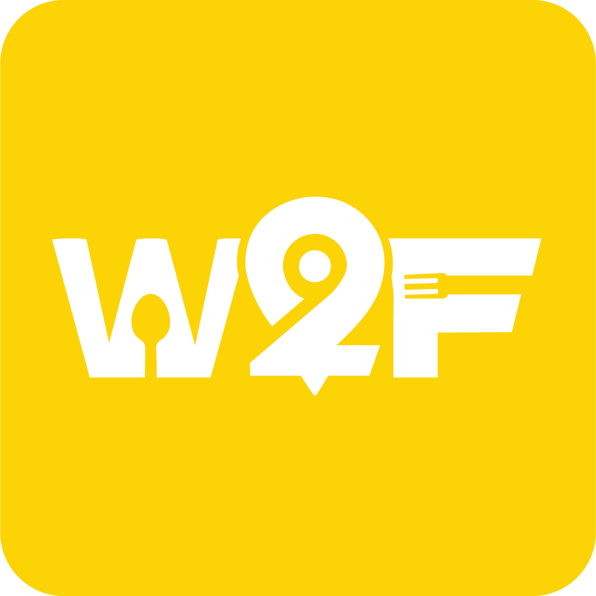
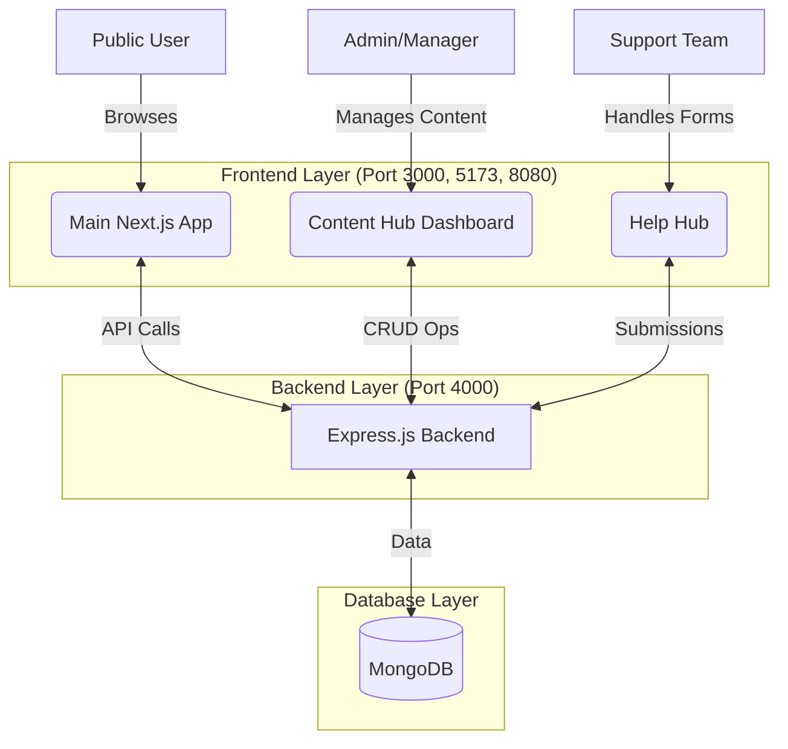

<p align="center">
  
</p>

<h1 align="center">Wander With Food (W2F)</h1>
<p align="center">
  <b>Experience the Future of Food Discovery & Restaurant Management</b>
</p>

<p align="center">
  
  
  
  
  
  
  
</p>

---

## 🍕 What is W2F?

**Wander With Food (W2F)** is a high-performance, enterprise-grade restaurant discovery ecosystem designed to bridge the gap between hungry diners and local eateries. It's not just a website; it's a multi-platform suite engineered for speed, engagement, and operational efficiency.

Built with a focus on **immersive user experience**, W2F leverages cutting-edge animation libraries to create a "liquid" interface that feels alive.

### Core Ecosystem
- 🌐 **Discovery Hub** — A Next.js-powered portal for users to explore, filter, and discover restaurants.
- 🛠️ **Operational Backend** — A robust Node/Express API managing high-frequency data and authentication.
- 🛡️ **Help Hub** — A dedicated support system with integrated Bug Bounty and Grievance workflows.
- 📊 **Content Hub** — A specialized administrative dashboard for real-time content and partner management.

---

## 🏗️ Architecture



---

## ✨ Key Features

| Feature | Description |
| :--- | :--- |
| 🎭 **Kinetic UI** | Fluid animations using GSAP and Framer Motion for a premium, high-end feel. |
| 🔍 **Pro-Grade Discovery** | Advanced multi-dimensional filtering by cuisine, district, rating, and distance. |
| 👨‍💼 **Unified Admin** | Full CRUD operations for restaurant menus, featured categories, and real-time updates. |
| 🛡️ **Grievance System** | Formal compliance and feedback channels with dedicated support tracking. |
| 🤝 **Partner Portal** | Exclusive partner management tools with custom branded footers and OTP authentication. |
| 📈 **Real-time Analytics** | Live dashboard metrics for restaurant performance and site traffic. |
| 🚀 **Hybrid Rendering** | Strategic use of Server-Side Rendering (SSR) and Client-Side Rendering (CSR) for SEO and speed. |
| 📸 **Media Library** | Centralized asset management for restaurant galleries and promotional banners. |

---

## 🛠️ Tech Stack

### Core Technologies
| Layer | Tech Stack |
| :--- | :--- |
| **Frontend Framework** | Next.js 14 (App Router), React 18 |
| **Styling** | Tailwind CSS 3, Shadcn/UI |
| **Animations** | GSAP (ScrollTrigger), Framer Motion |
| **Backend API** | Node.js, Express.js (NestJS architecture) |
| **Database** | MongoDB (Local/Atlas) |
| **Authentication** | JWT Bearer Tokens + OTP Service (Gmail SMTP) |
| **State Management** | React Context + Local Persistence |
| **Tooling** | Vite (for sub-apps), PNPM Workspace |

### UI Design System
- **Primary Color:** `#FFD402` (Vibrant Yellow)
- **Secondary Color:** `#1F2937` (Charcoal Black)
- **Typography:** Inter / Custom Modern Sans-Serif
- **Interactive Elements:** Glassy gradients, hover scales, and liquid transitions.

---

## 🚀 Getting Started

### Prerequisites
- **Node.js** ≥ 18
- **MongoDB** Local Service
- **NPM / PNPM** package manager

### 1. Installation & Setup
Clone the repository and install all dependencies using the root workspace command:
```bash
# Install dependencies for the entire monorepo
npm run setup:all
```

### 2. Configuration
Create a `.env.local` in `main-app/` and `backend/` using the following template:
```env
MONGODB_URI=mongodb://localhost:27017/wwf
NEXT_PUBLIC_API_URL=http://localhost:4000
SMTP_USER=your_email@gmail.com
SMTP_PASS=your_app_password
```

### 3. Launching the Ecosystem
You can start all services simultaneously with a single command:
```bash
# Starts API (4000), Main App (3000), Help Hub (5173), and Dashboard (8080)
npm run dev:all
```

---

## 📁 Project Structure

```text
W2F/
├── main-app/           # Next.js 14 - Primary Consumer Interface
├── backend/            # Express.js - Central API Gateway
├── help-hub/           # Vite/React - Support & Feedback Forms
├── dashboard/          # Vite/React - Admin & Content Management
├── scripts/            # Automation & Setup Utilities
└── docker/             # Containerization configurations
```

---

## 🔒 Security & Compliance
- **Authenticated Routes:** Admin and Partner dashboards protected via secure JWT tokens.
- **Data Validation:** Strict Mongoose schemas for all restaurant and user submissions.
- **Environment Isolation:** All sensitive keys (Stripe, SMTP, DB) managed via secure `.env` files.
- **Rate Limiting:** API protection to prevent brute-force attacks on submission endpoints.

---

## 📄 License
This project is provided for educational and enterprise demonstration purposes. All rights reserved.

<hr />

<p align="center">
  Built with ❤️ by <a href="https://github.com/NAVEEN78100">Naveen D</a> and Team
</p>